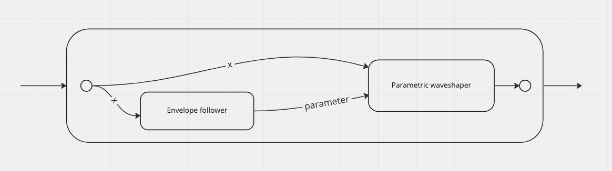

<div style="height: 100vh; width: 100vh; display: flex; justify-content: center; align-items: center; align-self: center; flex-direction: column;">
  <h1>Cómo programar un amplificador de guitarra?</h1>
  <h2>Santiago de León</h2>
  
</div>

---

# Sobre mí

* Experiencia:
  * <span style="color: green;">Aplicaciones / APIs: Java, Python/Django, PHP</span>
  * <span style="color: green;">Frontend: React</span>
  * <span style="color: green;">Aplicaciones móviles: React Native</span>
  * <span style="color: green;">Tareas de DevOps</span>
  * <span style="color: green;">Guitarra y producción musical</span>
  * <span style="text-decoration: line-through; text-decoration-thickness: 4px; color: red;">C++ / JUCE</span>
  * <stroke style="text-decoration: line-through; text-decoration-thickness: 4px; color: red;">Desarrollo de audio</stroke>
  * <stroke style="text-decoration: line-through; text-decoration-thickness: 4px; color: red;">Electrónica</stroke>
* Github:
  * https://github.com/sdeleon28/

---

# Objetivo

* Funcionalidades:
  * High gain amp
  * Simulación de cabinet
  * Distorsión "creíble"
  * Controles: ganancia, tono y level
  * Hacer un ampli que yo usaría para hacer mis canciones

---

# Objetivo


---

# Formas de conseguir nuestro objetivo

* Opción 1: Modelado de sistemas analógicos

---

# Modelado de sistemas analógicos

😰😰😰😰😰😰😰😰😰😰😰😰😰😰😰😰😰😰😰😰


😰😰😰😰😰😰😰😰😰😰😰😰😰😰😰😰😰😰😰😰

---

# Formas de conseguir nuestro objetivo

* <stroke style="text-decoration: line-through; text-decoration-thickness: 4px; color: red;">Opción 1: Modelado de sistemas analógicos</stroke>
  * 😰😰😰😰😰😰😰😰😰😰😰😰😰😰😰😰😰😰😰😰
* <stroke style="color: green;">Opción 2: Técnicas 100% digitales
</stroke>

---

# Clipeo

---

# Clipeo

<div style="display: flex; width: 90%; height: auto; flex-direction: row; justify-content: space-between;">
  <div style="flex: 1;">
    
  </div>
  <div style="flex: 1;">
    
  </div>
</div>

---

# Clipeo

<div style="display: flex; width: 90%; height: auto; flex-direction: row; justify-content: space-between;">
  <div style="flex: 1;">
    
  </div>
  <div style="flex: 1;">
    
  </div>
  <div style="flex: 1;">
    
  </div>
</div>

---

# Clipeo

<div style="display: flex; width: 90%; height: auto; flex-direction: row; justify-content: space-between;">
  <div style="flex: 1;">
    
  </div>
</div>

---

# Waveshaper estático

---

# Waveshaper estático

Una función matemática por la que pasa cada uno de tus samples

---

# Waveshaper estático


---

# Convolución

* Es la técnica más simple para simular un cab microfoneado
* Se graba una respuesta de impulso (IR) poniendo un micrófono frente al cab de tu amp
* O se puede descargar uno de internet hecho por otra persona
* JUCE trae una clase `Convolution` en su módulo `juce_dsp`

---

# Pre/post énfasis

* Pre-énfasis
  * Filtros posicionados antes del waveshaper para afectar el material a distorsionar
* Post-énfasis
  * Filtros posicionados después del waveshaper para moldear el tono de la señal distorsionada

---

# Pre/post énfasis - Frequalizer


https://foleysfinest.com/plugins/frequalizer/

---

# Waveshaper paramétrico

---

# Waveshaper paramétrico

```
f(x, parameter) = (x * (abs(x) + parameter) / (x * x + (parameter - 1) * abs(x) + 1)) * 0.7
```

---

# Waveshaper paramétrico

Pidamos ayuda a ChatGPT para graficar esto:


---

# Waveshaper paramétrico

Su respuesta:


---

# Waveshaper paramétrico

Instalar librerías nunca fue tan fácil:


---

# Waveshaper paramétrico

<video controls width="600" height="auto" name="Parametric waveshaper graph">
  <source src="../assets/colab-video.mov"></source>
</video>

---

# Waveshaper dinámico

---

# Waveshaper dinámico

* Waveshaper dinámico:
  * Envelope follower
  * Waveshaper paramétrico
* 

---

# Waveshaper dinámico



---

# Problema: Aliasing


---

# Solución: Oversampling

```cpp
auto ovBlock = oversampler.processSamplesUp (mainContext.getInputBlock());
dsp::ProcessContextReplacing<float> waveshaperContext(ovBlock);
waveshaper.process(waveshaperContext);
oversampler.processSamplesDown (mainContext.getOutputBlock());
```

---

# Control de tono


* Diferentes diseños posibles:
  * Conectar perilla de TONE a la ganancia del filtro
  * Hacer un low shelf y un high shelf y hacerlos moverse como los platos de una balanza ⚖️

---

# Vista aérea


---

# Ignition


Code available at https://github.com/sdeleon28/IgnitionGuitarAmp

Demo:

<audio controls>
  <source src="https://thmstudio.com/ignition-demo.mp3" type="audio/mpeg"></source>
</audio>

---

# Links

* The Audio Programmer -> https://www.youtube.com/@TheAudioProgrammer
* Tutoriales oficiales de JUCE -> https://juce.com/learn/tutorials/
* JUCE Class Index -> https://docs.juce.com/master/index.html
* Ivan Cohen - Fifty shades of distortion (ADC'17) -> https://youtu.be/oIChUOV_0w4
* Blue Mangoo Software - Comparing waveshaping functions for guitar amp modeling -> https://youtu.be/2fb47zQdLy0
* Frequalizer -> https://foleysfinest.com/plugins/frequalizer/
* RS-MET -> https://github.com/RobinSchmidt/RS-MET

---

# Más links

* Post en mi blog -> https://thmstudio.com/blog/how-i-made-a-guitar-amp-plugin/
* Estas slides -> https://github.com/sdeleon28/como-programar-un-amp
* Repo de Ignition -> https://github.com/sdeleon28/IgnitionGuitarAmp

---

<div style="height: 100vh; width: 100vh; display: flex; justify-content: center; align-items: center; align-self: center; flex-direction: column;">
  <h1>Preguntas?</h1>
</div>

<script type="text/javascript" src="https://livejs.com/live.js"></script>
